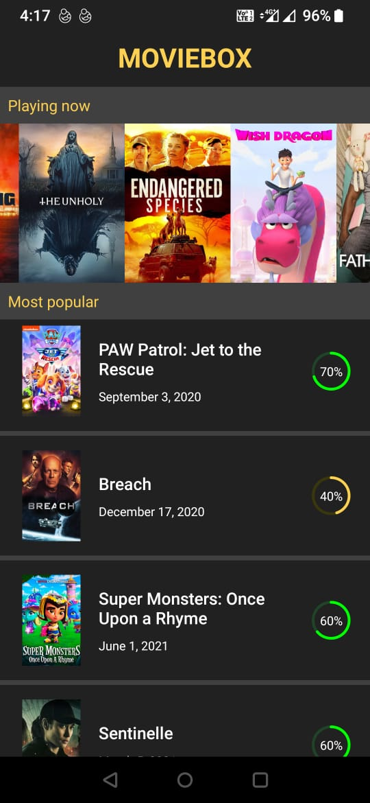
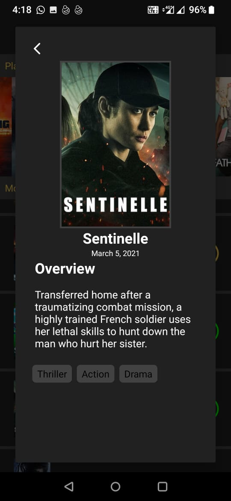

### BACKBASE ANDROID ASSIGNMENT

This Android Mobile App has been developed as part of an Assignment test

## Feature Requirements

The requirements for this assignment is to implement the below features on top of the provided running App.

* Create UI for MovieListScreen and MovieDetailScreen.
* MovieListScreen should display a two list, One for "Playing now" and
  the other for "Most popular" movies.
* Playing Now movies should be displayed as horizontal list, no
  pagination is needed.
* Most Popular movies should be displayed in a vertical list, here pagination is needed.
* Upon selecting a popular movie, the MovieDetailScreen should be shown
  with related information.
* Implement custom Rating View to display movie rating with their respective progresses.
* Implementation of image caching for smooth scrolling of the movies in the vertical list.
* App should support only portrait mode.

## Architecture

For this App development, I have followed MVVM architecture, below are the layers used for separation of concerns.

* Data -> Data Layer is responsible to fetch data from remote and map to the local data class.
* Repository -> The job of Repository is to access data layer.
* View Model -> The role of View Model is to access Repository and emits live data which will be observed by views.
* UI -> This is the presentation layer which shows the actual UI.

## Libraries Used

Basic libraries for android projects including some Jetpack Compose suit

* Kotlin Coroutines -> This is used for Asynchronous calls.
* Android Material Library -> For Material Themes in some views.
* Constraint Layout -> To usage in layouts.
* Android Navigation Library -> For App navigation.
* LiveData -> Used for MVVM implementation.
* Lifecycle Extensions -> Used for MVVM implementation.
* Page3 -> This is used to implement pagination for the movie list.
* Hilt -> This is used to implement dependency injection.
* Glide -> This is used for image caching.
* Retrofit2 -> This is used for Network Management.
* OkHttp3 -> This is used for basic networking management and lodging.
* GSON -> This is used for basic networking management and model management.

For Testing

* Mockito -> To mock dependencies
* JUnit5

## Different Phases of development

*PHASE 1*
The very first thing I have done is to have thorough requirement analysis and then divided the tasks into small pieces.
After that I came up with the design flow which I have followed completing all the feature requirements.

**Data Layer -> Repository -> ViewModel -> UI -> Unit Test **

While working on the data layer, I have made use of Kotlin data class Generator plugin in Android studio to generate DTO (Data Transfer Object) Models from JSON.
Then listed all required APIs in MovieServices class which fetches remote data with the help of Retrofit2.
I have mapped the DTO (Data Transfer Object) models to data model by having a mapper class which will be used in the UI.

*PHASE 2*
In this phase, I have worked on the Repository layer to access remote data source using MovieServices class.
Also, I have used the hilt for dependency injection. Initially I had challenged implementing DI as this was new to me but with some research I gained the required knowledge and could able to successfully implemented DI.

*PHASE 3*
Here I have started working on the ViewModels for fetching list of popular movies and as well as details about each movie.
The major functionality of ViewModel is to get data from the Repository.

*PHASE 4*

After getting all the required data from the above layers then I started working on the UI layer.
First I created layouts for lists and details screen.
In the vertical movie list i have implemented pagination by using PAGE3 library.
Also, for the rating view i have used custom view to achieve the desired UI.
and finally i have worked on the Unit tests.

## Final UI output

## Observations
* One observation I have is, I could not able to get the asset for App logo. Hence, I have used normal text with styling to make it resemble with the given Mockup.
* In case of Pagination it would have been better to have a loader on scrolling. Also i could have shown retry option whenever there is a network failure.  